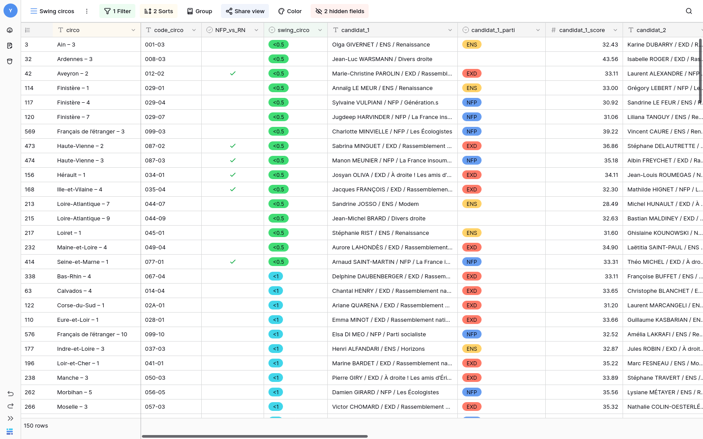

# Résultats des élections législatives 2024

Faute d'avoir trouvé les résultats des élections législatives 2024 en format utilisable, j'ai scrapé [cette ressource](https://www.contexte.com/article/pouvoirs/carte-des-legislatives-2024_193466.html).

Le but est de fournir les données nécessaires à ceux qui sont en train de construire des outils pour soutenir le NFP et de bloquer le RN.

Les données annotées sont disponibles en format CSV and XLSX dans le dossier `data/`.

Vous pouvez voir les résultats complets [ici](https://baserow.io/public/grid/khjvUbrxhDwLjIecAnqLzBil9DjNWddtEJ4PMxflJKg).

Et les swing circos ici: https://baserow.io/public/grid/xtrmyYy5BlXtG1PmzNFkycG2sBFoSDwjkYP29OBxYRg

Un projet similaire est disponible ici: https://github.com/oriionn/scrap-1er-tour-legislatives-2024

## Ce que vous devez faire

1. Trouvez les circos (proches de chez vous ou pas) qui sont des swing circos dans [cette table](https://baserow.io/public/grid/xtrmyYy5BlXtG1PmzNFkycG2sBFoSDwjkYP29OBxYRg) ou sur [cette carte](https://www.google.com/url?q=https://www.contexte.com/article/pouvoirs/carte-des-legislatives-2024_193466.html&sa=D&source=editors&ust=1719842723690157&usg=AOvVaw1LDC-xLGl6ZcMujRq5jcak)

2. Si les candidats ENS arrivés 3èmes **refusent de se désister**, contactez-les à travers https://shaketonpolitique.org/interpellations/elections-legislatives-2024/

3. Va sur [indivisibles.fr/5jourspourgagner/](), trouve le groupe public, intègre-le et signale-toi pour participer aux portes à portes et actions, ou trouve les réseaux sociaux du candidat et envoie un message disant que tu veux participer. 

4. Tu sais pas quoi dire, comment défendre ou attaquer ? Là t’as un document avec plein d’argus : bit.ly/argus_FM 

5. Tu veux la version express ? Va ici: https://docs.google.com/document/d/e/2PACX-1vSDMBkYi08GGLRBZEBejbQgUda-b_aMMuwBnhOXeNa8U7KuiQHsYCGwUrX7kCJQnFeSRRTKTk-JBke1/pub

5) Tu as de l’audience ? Utilise-là !

On a tous une responsabilité. Personne ne vit hors du monde.

# Front Populaire!
